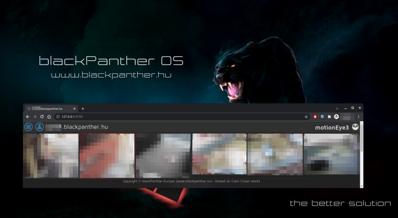
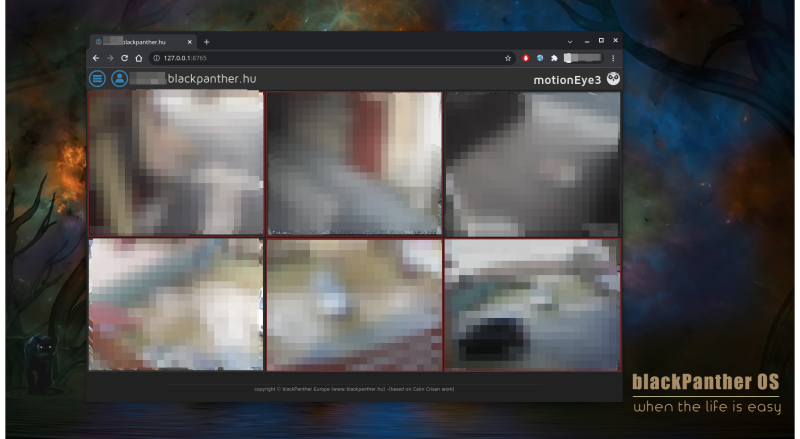

It's the time to we switch to Python3, what you think? Coming soon...

## The MotionEye3 fork of <a href="https://github.com/ccrisan/motioneye/wiki"> motionEye</a> `**`

Is a Python3 based web frontend for <a href="https://motion-project.github.io"> motion</a>. 
Check out the original <a href="https://github.com/blackPantherOS/motionEye3/wiki">wiki</a> for more details.

Finished:
  - Code migrated to Python3 
  - Local webcams detection fixed
  - RTSP Cameras adding fixed
  - Screens of JPEG cameras fixed (Motion < 4.3.2 use http:// format, Motion >= 4.4.0 use mjpeg:// for cameras)
  - Mask creation fixed
  - Localization support added
  - fixed preview for recorded videos
  - fixed preview for captured pictures
  - Hungraian 100% translation (translators for other languages are welcome)
  - RPM package based install supported 
  - Add 6 columns viewev for "bar-mode"

Planned:
  - Native face recogintion 
  - Native plate recogniton
  - Theme support
  - More static screen layouts

### Screenshots
 

Bar mode

 

Simple layout for std views

 

  

